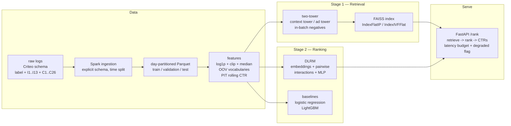

# CtrRankingPipeline

End-to-end ads click-through-rate (CTR) prediction and ranking system, modeled on how
production ad-serving stacks are built and measured: a two-stage architecture (fast
candidate retrieval, then deep ranking of the shortlist), leakage-free feature
engineering, ad-system offline metrics, and a served API with graceful degradation.

## Architecture



All fitted quantities (numeric clipping/medians, categorical vocabularies) are
computed on the **train split only**; validation/test reuse them, so offline
metrics are never inflated by leakage. Splits are temporal (17/2/2 days), never
random — see "Point-in-time correctness" below.

## Quickstart

```bash
make install    # uv (or venv + pip) editable install
make data       # data/parquet/{train,validation,test} (synthetic fallback, offline-safe)
make features   # data/features/{split} + fitted artifacts
make train      # two-tower + FAISS, then DLRM + LR/LGBM baselines
make eval       # artifacts/eval/: report.md/json, roc.png, reliability.png
make bench      # artifacts/bench/: closed-loop load test + batch-size sweep
make test       # pytest with coverage
make lint       # ruff

# serve
uvicorn ctr.serving.app:app --host 127.0.0.1 --port 8000
# or, with Docker:
docker compose up --build
```

## Results

All numbers below come from committed generated artifacts —
[`artifacts/eval/report.json`](artifacts/eval/report.json),
[`artifacts/bench/results.json`](artifacts/bench/results.json) — produced by
`make train && make eval && make bench` on a 1M-row synthetic Criteo-format
dataset (35k unique ads catalog, ~3.5% background CTR, injected day-over-day
drift).

### Ranker comparison (test split, same features for all models)

| model | AUC | logloss | NE | ECE | GAUC | calibration ratio |
| --- | --- | --- | --- | --- | --- | --- |
| DLRM | 0.5505 | 0.1735 | 1.0054 | 0.0090 | 0.5502 | 0.952 |
| Logistic regression | 0.5758 | 0.1809 | 1.0482 | 0.0185 | 0.5722 | 0.814 |
| LightGBM | **0.5879** | **0.1717** | **0.9950** | **0.0080** | **0.5844** | 0.810 |

GAUC groups by the user-segment field (`C14`). LightGBM wins on ranking quality;
the deep models are included as the production-style baselines they will grow
into (see "Next steps").

### Retrieval (IVF vs exact flat, 278,799-ad catalog)

| index | recall@100 vs flat | ms/query |
| --- | --- | --- |
| IndexFlatIP (exact) | 1.0000 | 0.18 |
| IndexIVFFlat (nlist=256, nprobe=8) | 0.9999 | **0.07** |

### Two-stage cap on ranking quality

- retrieval recall@10 / @50 / @100 = **0.904 / 0.968 / 1.000** (test positives)
- shortlist MRR@100 = 0.149, precision@1 = 0.008

Retrieval recall@k is the hard ceiling: a positive whose ad is not retrieved can
never be ranked by the downstream ranker, however good it is. Recall is high,
but shortlist MRR shows that fine-grained ordering *within* the candidate list is
where most ranking quality is lost today.

### Serving performance (closed-loop, 8 concurrent clients)

| metric | value |
| --- | --- |
| throughput | 635 QPS |
| end-to-end latency p50 / p95 / p99 | 11.9 / 14.4 / 24.8 ms |
| server-side split (mean) | retrieval 0.32 ms, ranking 0.78 ms |
| batch sweep items/s (1 / 8 / 32 / 128 / 512) | 479 / 773 / 645 / 710 / 620 |

## Why point-in-time correctness matters

Random splits leak: ad logs contain repeated users, advertisers and campaigns, so
a random split lets a model memorize per-entity CTRs from rows it will be tested
on. Time-based splits (train → validation → test in strict chronological order)
and point-in-time aggregates (rolling history that ends **before** each row's
`event_ts`, never including the row's own label) are the offline analogue of
serving, where models always predict the future. The PIT window implementation
is proven against hand-computed values — including a fixture where the naive
(leaky) group-by CTR provably differs — in
[`tests/test_pit.py`](tests/test_pit.py).

## Why NE and calibration instead of accuracy

With a ~3.5% click rate, a model that always predicts 0 has 96.5% accuracy.
Normalized entropy (log loss divided by the entropy of the background CTR, from
the Facebook ads paper) and calibration answer the questions ads systems
actually care about: *how much better than the background rate are my
probabilities, and can I bid with them?* A calibration ratio of 0.81 (LR/LGBM
above) means systematic under-prediction — underbidding and lost revenue — which
is exactly what the 20-bucket reliability curve and ECE surface. The slice
report in `artifacts/eval/report.md` flags segments where calibration leaves
[0.9, 1.1] or AUC drops more than 2 points below global.

## Retrieval quality/latency tradeoff

`IndexFlatIP` is exact but scales linearly; `IndexIVFFlat` trades a little recall
(0.9999 vs 1.0 at k=100 here) for ~2.5x lower latency per query, and the
tradeoff is configurable through `nlist`/`nprobe` (`configs/retrieval.yaml`).
The serving layer adds the standard graceful-degradation pattern on top: a
latency budget per request — when retrieval consumes too much of it, the
candidate set is truncated and `degraded: true` is returned instead of blowing
the deadline.

## Limitations and next steps

- **Synthetic data.** The pipeline runs offline on a deterministic Criteo-format
  generator; the same code paths work with the real `dac_sample.tar.gz`
  (configurable URL in `configs/data.yaml`).
- **Pair-specific features in retrieval.** The PIT aggregates are pair-specific
  yet folded into the context tower — a documented simplification. A production
  two-tower computes them per candidate at scoring time via a feature store.
- **Weak shortlist ranking** (MRR 0.149): the ranker is trained on observed
  impressions, not on retrieved negatives; calibrating it on retrieval-shaped
  negatives is the highest-value next step.
- **Next steps:** online learning / retraining on trailing logs, a multi-task
  value model (pCTR × pCVR × bid), position-bias correction, and per-candidate
  feature computation in serving.

## Layout

```
ctr/            main package
  data/         dataset generation + Spark ingestion (explicit schema, time splits)
  features/     train-fit transforms + point-in-time aggregates
  retrieval/    two-tower + FAISS index with benchmarks
  models/       DLRM, LR/LGBM baselines, training loop
  eval/         ad-system metrics, slice analysis, report generation
  serving/      FastAPI service with graceful degradation
configs/        YAML configs per stage
scripts/        CLI entrypoints (download, ingest, features, train, eval, benchmark)
tests/          pytest suite (unit + Spark integration + leakage proofs)
notebooks/      exploration notebooks
```
